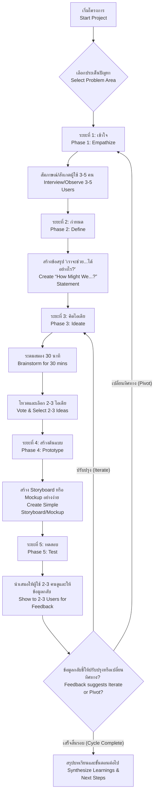

## **Design Thinking: The Importance of Design Thinking / การคิดเชิงออกแบบ: ความสำคัญของการคิดเชิงออกแบบ**

---

## **1. บทนำ / Introduction**

โลกธุรกิจและสังคมในปัจจุบันเผชิญกับความท้าทายที่ซับซ้อนและเปลี่ยนแปลงอย่างรวดเร็ว วิธีแก้ปัญหาแบบเดิมๆ มักไม่เพียงพออีกต่อไป **การคิดเชิงออกแบบ (Design Thinking)** จึงเกิดขึ้นเป็นกระบวนการและกรอบความคิดเชิงมนุษยนิยม (Human-Centered) ที่ช่วยให้ทีมและองค์กรสามารถทำความเข้าใจปัญหาอย่างลึกซึ้ง คิดค้นนวัตกรรม และสร้างวิธีแก้ปัญหาที่ตรงจุดและยั่งยืน

การคิดเชิงออกแบบไม่ใช่เพียงเครื่องมือสำหรับนักออกแบบ แต่เป็นระเบียบวิธีที่ทุกคนสามารถนำไปใช้ได้เพื่อส่งเสริมความคิดสร้างสรรค์ การทำงานร่วมกัน และการทดลองเพื่อการเรียนรู้

**In today's rapidly changing world, businesses and societies face increasingly complex challenges. Traditional problem-solving methods are often no longer sufficient. **Design Thinking** has emerged as a human-centered process and mindset that enables teams and organizations to deeply understand problems, innovate, and create impactful, sustainable solutions.

Design Thinking is not just a tool for designers; it is a methodology that anyone can adopt to foster creativity, collaboration, and learning through experimentation.

---

## **2. นิยาม / Definition**

**การคิดเชิงออกแบบ (Design Thinking)** คือ กระบวนการคิดเชิงระบบและสร้างสรรค์ที่มุ่งเน้นผู้ใช้เป็นศูนย์กลาง (Human-Centered) เพื่อทำความเข้าใจความต้องการที่แท้จริง ท้าทายสมมติฐานเดิม และกำหนดปัญหาใหม่ ๆ ก่อนจะสร้างสรรค์แนวทางการแก้ปัญหาผ่านการสร้างต้นแบบและทดสอบอย่างรวดเร็ว

**Design Thinking** is a systematic, creative, and human-centered process for understanding real user needs, challenging assumptions, redefining problems, and creating innovative solutions through rapid prototyping and testing.

---

## **3. หัวข้อหลัก / Core Topics**

### **3.1 หลักการพื้นฐาน / Core Principles**
*   **มนุษย์เป็นศูนย์กลาง (Human-Centered):** เริ่มต้นและจบกระบวนการด้วยความต้องการและประสบการณ์ของผู้ใช้
*   **ร่วมมือข้ามสายงาน (Collaborative):** รวบรวมมุมมองที่หลากหลายจากหลายทีมและหลายสาขาวิชา
*   **ลงมือทำอย่างเป็นรูปธรรม (Hands-On & Experimental):** เน้นการ "สร้าง" เพื่อ "เรียนรู้" ผ่านการสร้างต้นแบบ
*   **ปรับตัวได้และยืดหยุ่น (Iterative & Flexible):** เป็นวัฏจักรที่ไม่เป็นเส้นตรง สามารถย้อนกลับไปขั้นตอนก่อนหน้าได้เสมอ
*   **มุ่งเน้นการดำเนินการ (Action-Oriented):** ส่งเสริมการทดลองและเรียนรู้จากความล้มเหลวอย่างรวดเร็ว

### **3.2 ระยะของกระบวนการ (Non-Linear Phases)**
1.  **เข้าใจ (Empathize):** ทำความเข้าใจผู้ใช้และปัญหาอย่างลึกซึ้งผ่านการสังเกต การสัมภาษณ์ และการมีส่วนร่วม
2.  **กำหนด (Define):** สรุปข้อมูลจากขั้นเข้าใจมาเป็นข้อสรุปเกี่ยวกับปัญหาและความต้องการหลัก (Point of View)
3.  **คิดไอเดีย (Ideate):** ระดมสมองสร้างแนวคิดและวิธีการแก้ปัญหาที่หลากหลาย โดยไม่ตัดสินในขั้นนี้
4.  **สร้างต้นแบบ (Prototype):** สร้างวิธีแก้ปัญหาอย่างง่าย รวดเร็ว และราคาต่ำเพื่อนำไปทดสอบ
5.  **ทดสอบ (Test):** นำต้นแบบไปทดสอบกับผู้ใช้จริง เพื่อรวบรวมข้อมูลป้อนกลับ ปรับปรุงแนวคิด หรือแม้กระทั่งกำหนดปัญหาใหม่

### **3.3 ประโยชน์และความสำคัญ / Benefits & Importance**
*   **ส่งเสริมนวัตกรรม:** สร้างสินค้า บริการ หรือกระบวนการใหม่ที่ตอบโจทย์ผู้ใช้จริง
*   **ลดความเสี่ยง:** ตรวจสอบสมมติฐานและความต้องการของตลาดก่อนลงทุนสูง
*   **เพิ่มการมีส่วนร่วมของลูกค้า:** สร้างความภักดีผ่านการแก้ปัญหาที่ตรงใจ
*   **พัฒนาความร่วมมือในทีม:** สร้างภาษาและเป้าหมายร่วมกัน across functions.
*   **เพิ่มความรวดเร็วในการเรียนรู้:** เรียนรู้จากความล้มเหลวอย่างรวดเร็วและปรับปรุงให้ดีขึ้นอย่างต่อเนื่อง

---

## **4. ออกแบบคู่มือ / Guide Design**

### **คู่มือเริ่มต้นการคิดเชิงออกแบบอย่างรวดเร็ว**
**(A Quick-Start Guide to Design Thinking)**

**เป้าหมาย:** สำหรับทีมที่ต้องการทดลองใช้ Design Thinking กับโครงการขนาดเล็กภายใน 1-2 วัน
**วัตถุประสงค์:** เพื่อทำความเข้าใจปัญหาของผู้ใช้และสร้างแนวคิดต้นแบบอย่างง่ายสำหรับทดสอบ

---

## **5. ออกแบบเวิร์กโฟลว์ / Workflow Design**

---

## **6. ออกแบบเทมเพลต / Template Design**

### **เทมเพลตบันทึกการสัมภาษณ์เพื่อความเข้าใจผู้ใช้ / User Interview Empathy Template**

| **ส่วน / Section**          | **คำถามตัวอย่าง / Example Questions**                          | **บันทึกจากการสัมภาษณ์ / Interview Notes**                     | **อารมณ์และความต้องการที่ซ่อนอยู่ / Emotions & Unmet Needs** |
| --------------------------- | -------------------------------------------------------------- | -------------------------------------------------------------- | ------------------------------------------------------------ |
| **ข้อมูลพื้นฐาน / Background** | "เล่าเรื่องราวเกี่ยวกับการ...[ปัญหาที่เกี่ยวข้อง]...ให้ฟังหน่อย"   "Tell me a story about the last time you...[related problem]..." |                                                                |                                                              |
| **ความท้าทาย / Challenges**  | "ส่วนที่ยากที่สุดคืออะไร?"   "What was the most difficult part?" |                                                                |                                                              |
| **ความรู้สึก / Feelings**     | "คุณรู้สึกอย่างไรตอนนั้น?"   "How did you feel at that moment?" |                                                                |                                                              |
| **ความพยายามแก้ไข / Attempts** | "คุณเคยลองทำอะไรเพื่อแก้ปัญหานี้บ้าง?"   "What have you tried to do to solve this?" |                                                                |                                                              |
| **ความปรารถนา / Desires**    | "ในฝัน คุณอยากให้มันเป็นอย่างไร?"   "In an ideal world, how would this work?" |                                                                |                                                              |

---

## **7. ตัวอย่างเช็คลิสต์ / Checklist Example**

### **เช็คลิสต์ก่อนเริ่มเวิร์กชอปการคิดเชิงออกแบบ / Pre-Design Thinking Workshop Checklist**

**ก่อนงาน 1 สัปดาห์ / One Week Before:**
- [ ] **กำหนดเป้าหมายและขอบเขตที่ชัดเจน:** โครงการนี้ต้องการบรรลุอะไร? (Define clear goal & scope)
- [ ] **ระบุและติดต่อผู้ใช้เพื่อสัมภาษณ์:** มีผู้ใช้ที่หลากหลายพอ (ประมาณ 3-5 คน) (Identify & recruit diverse users)
- [ ] **เตรียมพื้นที่และอุปกรณ์:** กระดาษ flipchart, ปากกาโพสต์อิท, ปากกาหลากสี, กล้อง (Prepare space & materials)
- [ ] **สร้างวาระการประชุมและแจกจ่ายล่วงหน้า:** (Create & share agenda)
- [ ] **เชิญผู้เข้าร่วมที่หลากหลายจากหลายฝ่าย:** (Invite cross-functional participants)

**วันก่อนงาน / Day Before:**
- [ ] **พิมพ์เอกสารและเทมเพลตทั้งหมด:** (Print all templates & worksheets)
- [ ] **ทดสอบเทคโนโลยี/อุปกรณ์ถ่ายภาพ/บันทึกเสียง:** (Test tech/recording equipment)
- [ ] **จัดเตรียมพื้นที่:** โต๊ะสำหรับทำงานกลุ่ม, ผนังสำหรับติดโพสต์อิท (Set up the room)
- [ ] **เตรียมของว่างและเครื่องดื่ม:** (Prepare snacks & drinks)

**วันงาน (เริ่มต้น) / Workshop Day (Start):**
- [ ] **ทบทวนเป้าหมายและกฎพื้นฐาน:** (Review goals & ground rules)
- [ ] **สร้างบรรยากาศปลอดภัยสำหรับความคิดสร้างสรรค์:** (Establish safe space for creativity)
- [ ] **มั่นใจว่าทุกคนเข้าใจกระบวนการ:** (Ensure everyone understands the process)