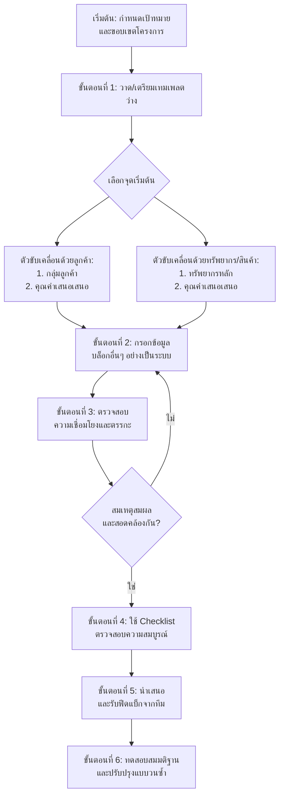

## **Business Model Canvas (BMC) - Design & Implementation Package**
## **ภาษาไทย & English**

---

- 1 ลูกค้าคือใคร หรือ Customer Segments (CS): ธุรกิจต้องระบุให้ได้ว่าใครคือกลุ่มเป้าหมาย ควรระบุให้ชัดเจน ยิ่งลึกยิ่งดี เพราะจะได้นำเสนอคุณค่าของสินค้าได้ตรงกับความต้องการของกลุ่มเป้าหมายที่สุด
- 2 คุณค่าของสินค้าหรือบริการคืออะไร หรือ Value Proposition (VP): ธุรกิจต้องมั่นใจและหาให้ได้ว่าคุณค่าของสินค้าบริการ ที่ส่งมอบให้ลูกค้า จะตอบโจทย์ความต้องการ หรือแก้ปัญหาให้กับกลุ่มลูกค้าเป้าหมายได้
- 3 ขายผ่านช่องทางไหน หรือ Channels (CH): ธุรกิจต้องวิเคราะห์ให้ออกว่าช่องทางการสื่อสาร และช่องทางการส่งมอบสินค้า ช่องทางแบบไหนที่เหมาะกับกลุ่มเป้าหมาย และมีประสิทธิภาพมากที่สุด
- 4 สร้างสายสัมพันธ์กับลูกค้าได้อย่างไร หรือ Customer Relationships (CR): ธุรกิจมีวิธีในการสร้างและรักษาความสัมพันธ์กับลูกค้าอย่างไร เพื่อให้เกิดการใช้สินค้าบริการต่อเนื่อง รวมถึงบอกต่อ
- 5 มีโครงสร้างรายได้อย่างไร หรือ Revenue Streams (RS): โมเดลรายได้ของธุรกิจสตาร์ทอัพ มีหลากหลายรูปแบบ ธุรกิจจึงต้องมองให้ออกว่า เราจะสร้างรายได้ด้วยวิธีการใด เช่น จากส่วนแบ่งจากค่าสินค้าบริการ จากค่าสมาชิก หรือจากค่าโฆษณา เป็นต้น
- 6 ทรัพยากรของบริษัทคืออะไร หรือ Key Resources (KR): คือเงินลงทุน เทคโนโลยีต่างๆ ซึ่งรวมไปถึงทรัพยากรบุคคล ซึ่งธุรกิจจำเป็นต้องรู้ว่าบริษัทมี KR ที่เหมาะสมหรือเพียงพอต่อการทำธุรกิจหรือไม่
- 7 กิจกรรมที่ขับเคลื่อนธุรกิจคืออะไร หรือ Key Activities (KA): คือการมองว่างานหลักของธุรกิจคืออะไร เทียบกับคู่แข่งเป็นอย่างไร จะสามารถสร้างกิจกรรม หรือ Solutions ใหม่ๆ ให้ลูกค้าได้อย่างไรบ้าง
- 8 คู่ค้าคือใคร หรือ Key Partners (KP): หุ้นส่วนทางธุรกิจเป็นใครได้บ้าง ที่จะมาช่วยส่งเสริม หรือเติมเต็มให้ธุรกิจมีความแข็งแกร่งมากขึ้น
- 9 ค่าใช้จ่ายหลักของธุรกิจคืออะไร หรือ Cost Structure (CS): คือค่าใช้จ่ายทั้งรายจ่ายคงที่และไม่คงที่ เช่น ค่าน้ำ ค่าไฟ ค่าวัตถุดิบ ค่าแรงงาน รวมถึงค่าใช้จ่ายทางด้านการตลาด ที่เมื่อนำรายจ่ายเหล่านี้ไปลบกับรายได้แล้ว ผลลัพธ์ที่ได้คือผลตอบแทนที่กิจการจะได้รับกลับมา
- การร่าง BMC ทั้ง 9 ช่องนี้จะช่วยให้เราคิดรอบด้าน และทำให้เห็นภาพรวมของธุรกิจ สามารถสื่อสารกับทีมงาน ให้เข้าใจได้ง่าย และไปในทิศทางเดียวกัน ว่ากำลังส่งมอบคุณค่าอะไรให้กับลูกค้ากลุ่มไหน ผ่านช่องทางอะไร ด้วยกิจกรรมอะไร และทรัพยากรอะไร ด้วยรายได้ต้นทุนอย่างไร ก็จะทำให้เราเห็นจุดที่สามารถพัฒนาปรับปรุงได้ รวมถึงรู้ว่าธุรกิจควรจะต้อง Focus ไปในทิศทางไหน ซึ่ง BMC สามารถปรับเปลี่ยนได้ตามความเหมาะสมของรูปแบบธุรกิจที่เปลี่ยนแปลงไป

### **1. บทนำ / Introduction**
**ภาษาไทย:**  
คู่มือนี้จัดทำขึ้นเพื่อเป็นแนวทางการออกแบบและใช้งาน **Business Model Canvas (BMC)** อย่างเป็นระบบ ครอบคลุมตั้งแต่การทำความเข้าใจนิยาม องค์ประกอบ แบบฝึกหัด การออกแบบเวิร์กโฟลว์ เทมเพลตพร้อมใช้งาน รวมถึง Checklist สำหรับตรวจสอบความสมบูรณ์ เพื่อให้ผู้ประกอบการ นักศึกษา และทีมงานสามารถนำ BMC ไปประยุกต์ใช้ในการพัฒนาโมเดลธุรกิจได้อย่างมีประสิทธิภาพ

**English:**  
This manual is designed to provide a systematic guide for creating and implementing the **Business Model Canvas (BMC)**. It covers definitions, key components, practical exercises, workflow design, ready-to-use templates, and a completeness checklist. The guide aims to help entrepreneurs, students, and teams effectively apply the BMC to develop and refine their business models.

---

### **2. นิยาม / Definition**
**ภาษาไทย:**  
**Business Model Canvas (BMC)** คือ เครื่องมือเชิงกลยุทธ์ที่ใช้อธิบายองค์ประกอบหลักของธุรกิจในหน้าเดียว ประกอบด้วย 9 องค์ประกอบสำคัญ เพื่อแสดงให้เห็นถึงตรรกะของการสร้างรายได้และคุณค่าให้กับธุรกิจ

**English:**  
The **Business Model Canvas (BMC)** is a strategic management tool that describes the key components of a business on a single page. It consists of 9 essential building blocks, illustrating the logic of how a company creates, delivers, and captures value.

---

### **3. หัวข้อ / Key Components (The 9 Building Blocks)**
**ภาษาไทย & English:**

| ลำดับ / No. | องค์ประกอบ / Block (TH) | Block (EN) | คำอธิบายโดยย่อ / Brief Description |
|-------------|------------------------|------------|-----------------------------------|
| 1 | **กลุ่มลูกค้า** | **Customer Segments** | กลุ่มคนหรือองค์กรที่ธุรกิจมุ่งหวังจะเข้าถึงและบริการ |
| 2 | **คุณค่าเสนอเสนอ** | **Value Propositions** | สินค้า/บริการที่แก้ปัญหาหรือตอบสนองความต้องการของลูกค้า |
| 3 | **ช่องทางการจัดส่ง** | **Channels** | วิธีที่ธุรกิจสื่อสารและส่งมอบคุณค่าให้ถึงลูกค้า |
| 4 | **ความสัมพันธ์กับลูกค้า** | **Customer Relationships** | ประเภทของความสัมพันธ์ที่ธุรกิจสร้างกับแต่ละกลุ่มลูกค้า |
| 5 | **กระแสรายได้** | **Revenue Streams** | วิธีที่ธุรกิจสร้างรายได้จากกลุ่มลูกค้าแต่ละกลุ่ม |
| 6 | **ทรัพยากรหลัก** | **Key Resources** | สินทรัพย์ที่สำคัญที่สุดที่ทำให้โมเดลธุรกิจทำงานได้ |
| 7 | **กิจกรรมหลัก** | **Key Activities** | การกระทำที่สำคัญที่สุดที่ทำให้โมเดลธุรกิจทำงานได้ |
| 8 | **พันธมิตรหลัก** | **Key Partnerships** | เครือข่ายของซัพพลายเออร์และพันธมิตรที่ทำให้โมเดลทำงาน |
| 9 | **โครงสร้างต้นทุน** | **Cost Structure** | ต้นทุนทั้งหมดที่เกิดขึ้นจากการดำเนินโมเดลธุรกิจ |

---

### **5. ออกแบบคู่มือ / Guide Design**
**ภาษาไทย:**  
คู่มือนี้ควรใช้งานโดย:
1.  **เริ่มจากฝั่งขวาของ Canvas:** เริ่มที่ **กลุ่มลูกค้า** และ **คุณค่าเสนอเสนอ** ก่อน เพราะเป็นหัวใจของธุรกิจ
2.  **ใช้ Post-it หรือเครื่องมือดิจิทัล:** เขียนไอเดียแต่ละข้อแยกกัน เพื่อสามารถจัดลำดับและปรับเปลี่ยนได้ง่าย
3.  **ทำงานเป็นทีม:** รวบรวมมุมมองจากทุกฝ่าย (การตลาด, การขาย, การผลิต, การเงิน)
4.  **ทดสอบสมมติฐาน:** พิจารณาแต่ละบล็อกว่าเป็น "ข้อเท็จจริง" หรือ "สมมติฐาน" ที่ต้องทดสอบและพิสูจน์
5.  **เชื่อมโยงและตรวจสอบความสอดคล้อง:** ตรวจสอบว่าคุณค่าสอดคล้องกับความต้องการของลูกค้าและช่องทางเหมาะสมหรือไม่ กิจกรรมและทรัพยากรสอดรับกันหรือไม่ รายได้ครอบคลุมต้นทุนหรือไม่

**English:**  
This guide should be used by:
1.  **Start from the right side of the Canvas:** Begin with **Customer Segments** and **Value Propositions**, as they are the heart of the business.
2.  **Use Post-its or digital tools:** Write each idea separately for easy sorting and modification.
3.  **Work as a team:** Gather perspectives from all departments (marketing, sales, operations, finance).
4.  **Test your hypotheses:** Treat each block as a "fact" or a "hypothesis" that needs to be tested and validated.
5.  **Connect and check for consistency:** Ensure value propositions match customer needs, channels are appropriate, activities align with resources, and revenue covers costs.

---

### **6. ออกแบบเวิร์กโฟลว์ / Workflow Design**
**ขั้นตอนการทำงาน (Recommended Workflow):**

---

### **7. ออกแบบเทมเพลต / Template Design**
**รูปแบบพื้นฐาน (Basic Template Layout):**
(ใช้ตาราง 3x4 สำหรับ 9 บล็อก โดยบล็อกกลางคือ "คุณค่าเสนอเสนอ")

**Business Model Canvas Template**

| **Key Partners** (พันธมิตรหลัก) | **Key Activities** (กิจกรรมหลัก) | **Value Propositions** (คุณค่าเสนอเสนอ) | **Customer Relationships** (ความสัมพันธ์กับลูกค้า) | **Customer Segments** (กลุ่มลูกค้า) |
| :--- | :--- | :---: | :--- | :--- |
| *ใครคือพันธมิตร/ซัพพลายเออร์สำคัญ?* | *กิจกรรมใดที่สำคัญที่สุด?* | **เราสร้างคุณค่าอะไรให้ลูกค้า?** *แก้ปัญหาอะไร?* *ตอบสนองความต้องการใด?* | *เราจะสร้างและรักษาความสัมพันธ์กับลูกค้าอย่างไร?* | *เรากำลังสร้างคุณค่าให้ใคร?* |
| **Key Resources** (ทรัพยากรหลัก) | | **ผลิตภัณฑ์/บริการอะไร?** *อะไรที่ทำให้เราแตกต่าง?* | **Channels** (ช่องทางการจัดส่ง) | |
| *ทรัพยากรที่สำคัญที่สุดคืออะไร?* | | | *ช่องทางใดที่ลูกค้าต้องการให้เราใช้?* | |
| | **Cost Structure** (โครงสร้างต้นทุน) | | **Revenue Streams** (กระแสรายได้) | |
| | *ต้นทุนสำคัญที่สุดของธุรกิจคืออะไร?* | | *ลูกค้ายินดีจ่ายเงินเพื่ออะไร?* | |

---

### **8. CHECKLIST เทมเพลต / Template CHECKLIST**
**ภาษาไทย:**
- [x] **กลุ่มลูกค้า:** ระบุชัดเจน จำเพาะเจาะจง ไม่ใช่ "ทุกคน"
- [ ] **คุณค่าเสนอเสนอ:** ตอบโจทย์ปัญหาหรือความต้องการของกลุ่มลูกค้าที่ระบุไว้ ชัดเจนและโดดเด่น
- [x] **ช่องทาง:** เหมาะสมกับพฤติกรรมของกลุ่มลูกค้า ครอบคลุมทั้งการรับรู้ การซื้อ และการหลังขาย
- [x] **ความสัมพันธ์:** สอดคล้องกับกลุ่มลูกค้าและคุณค่าเสนอเสนอ (เช่น บริการส่วนตัว, แบบบริการตัวเอง)
- [ ] **กระแสรายได้:** สอดคล้องกับสิ่งที่ลูกค้าจ่าย มาจากกลุ่มลูกค้าหลัก และมีรูปแบบที่ชัดเจน (เช่น ขายตรง, สมัครสมาชิก)
- [ ] **ทรัพยากรหลัก:** มีทรัพยากรที่จำเป็น (คน, เทคโนโลยี, เงิน) ในการสร้างและส่งมอบคุณค่า
- [x] **กิจกรรมหลัก:** มีกิจกรรมที่จำเป็นในการทำให้โมเดลธุรกิจทำงานได้จริง
- [x] **พันธมิตรหลัก:** ระบุพันธมิตรที่ช่วยลดความเสี่ยงหรือเพิ่มศักยภาพ
- [ ] **โครงสร้างต้นทุน:** ระบุต้นทุนหลักได้ และมีตรรกะที่สัมพันธ์กับทรัพยากรและกิจกรรม
- [x] **ความเชื่อมโยง:** ทุกบล็อกเชื่อมโยงกันอย่างเป็นตรรกะ โดยเฉพาะ "คุณค่าเสนอเสนอ" ซึ่งเป็นศูนย์กลาง

**English:**
- [ ] **Customer Segments:** Clearly defined and specific, not "everyone".
- [ ] **Value Propositions:** Clearly addresses the problems/needs of the defined customer segments. Unique and compelling.
- [ ] **Channels:** Appropriate for the customer segments' behavior. Covers awareness, purchase, and after-sales.
- [ ] **Customer Relationships:** Fits the customer segment and value proposition (e.g., personal assistance, self-service).
- [ ] **Revenue Streams:** Logically derived from what the customer pays for. Comes from key segments with clear pricing (e.g., direct sale, subscription).
- [ ] **Key Resources:** Necessary resources (human, technological, financial) to create and deliver value are identified.
- [ ] **Key Activities:** Key actions needed to make the business model work are listed.
- [ ] **Key Partnerships:** Key partners who help reduce risk or leverage the model are identified.
- [ ] **Cost Structure:** Major costs are outlined and logically tied to resources and activities.
- [ ] **Internal Consistency:** All blocks are logically interconnected, with the "Value Propositions" at the core.

---
**หมายเหตุ / Note:** ชุดเอกสารนี้สามารถนำไปพิมพ์ ปรับใช้ในเวิร์กช็อป หรือแปลงเป็นไฟล์ดิจิทัลสำหรับการทำงานร่วมกันออนไลน์ได้ / *This package can be printed, adapted for workshops, or converted into digital formats for online collaboration.*